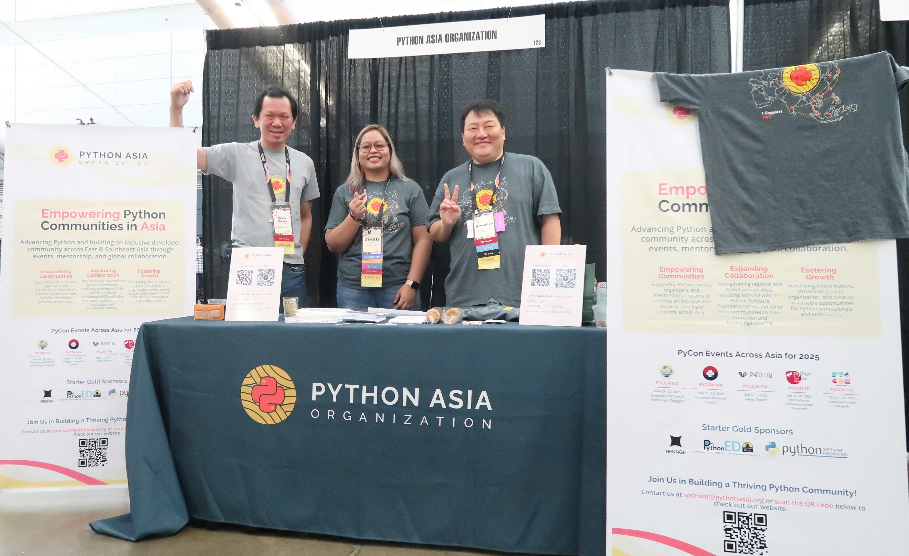

# カンファレンス1日目

カンファレンス1日目です。
今回宿泊しているホテルはカンファレンス会場とつながっており、外に出ないで会場に行けるのでとても楽です。

## 朝食

カンファレンス中は、毎日会場で朝食が提供されます。
ベーグル、フルーツ、ヨーグルト、コーヒー、紅茶などが提供されており私には十分です。

```{figure} images/breakfast.jpg
:width: 400

カンファレンス会場で朝食
```

ディスプレイボードには各部屋で今日どんなトークがあるかが表示されています。
Room 301-305のところに私の発表「How to learn Japanese with Python」も表示されています。
実感が湧くとともに、だんだん緊張してきました。

```{figure} images/display-board.jpg
:width: 200

ディスプレイボード
```

## Welcome、PSF Welcome

* ビデオ：<https://www.youtube.com/watch?v=flnVc2Ke-bw>
* ビデオ：<https://www.youtube.com/watch?v=vuQ6QX2zcMo>

朝は「Welcome」というタイトルでカンファレンスのオープニングです。
ConferenceのChairであるElaine Wong氏から参加者へ歓迎のあいさつがありました。
Co-Chair、PSFスタッフ、スポンサー、Committee Chairsなど、イベント開催に尽力してくれた関係者への感謝が述べられました。

```{figure} images/elaine.jpg
:width: 400

Elaine Wong氏
```

会場案内や各種イベントが紹介され、カンファレンスの前に開催されたチュートリアルや各種イベントについても簡単に報告がありました。
オープンスペース（その場で申し込んでディスカッションなどができる場）とライトニングトークは申し込みが電子化されました！！
いままでは付箋を貼ったりボードに書き込んでいましたが、ついに電子化されました。

nVIDIA、Metaのスポンサートークと、オープンソースのセキュリティの向上を目指す[Alpha Omega](https://alpha-omega.dev/)プロジェクトのトークがありました。

ついでPSF（Python Software Foundation）のExecutive Directorである[Deb Nicholson](https://www.python.org/psf/records/staff/)氏による「PSF Welcome」です。
PyPIでのダウンロードが伸びていること、PyPIでの組織アカウントが増えているという話がありました。
また、PSFからの助成金（Grants）プログラムについても述べられました。
各地域への助成金での支援が増えているようです。

```{figure} images/deb.jpg
:width: 200

Deb Nicholson氏
```

その後は**Weird**（奇妙な）をキーワードに、いろいろ予測不能な奇妙な時代だけど、私たち奇妙な人達が、一緒にPyCon USで奇妙な時間を過ごしましょう！！というトークがされました。
確かに、自分も含めて奇妙な人達が奇妙な時間を過ごしているよな、と感じました。

後半ではPSFスタッフやPSFのボードメンバーなどが紹介されましたが、「世界中にたくさんのボランティアがいます」というスライドで、PyCon JP 2024のライトニングトークの出番待ちの写真が使われていました。これにはびっくりです。
当日司会をしていた[Jonasさん](https://github.com/ojii)や、LT待ちの[中神さん](https://x.com/hajime_nakagami)がPyCon USデビューしていました。

```{figure} images/volunteers.jpg
:width: 400

「何千人のボランティア」を紹介するスライド
```

## Keynote: Cory Doctorow

* ビデオ：<https://www.youtube.com/watch?v=ydVmzg_SJLw>
* <https://p2ptk.org/monopoly/5369>

```{figure} images/cory.jpg
:width: 400

Cory Doctorow氏
```

## How to learn Japanese with Python

* スピーカー：Takanori Suzuki
* ビデオ：<https://www.youtube.com/watch?v=3wQxP-GfT-A>
* スライド：<https://slides.takanory.net/slides/20250516pyconus/>

```{figure} images/takanory.jpg
:width: 400

筆者の発表の様子
```

## 503 days working full-time on FOSS: lessons learned

* <https://us.pycon.org/2025/schedule/presentation/164/>
* ビデオ：<https://www.youtube.com/watch?v=iURLDirfmno>
* contributing guide
* issue template
* give first reply quickly
* 4つのポイントを常に考える

## Duolingoのパーティー

この日は企業主催のパーティーがいくつかありました。
筆者が把握している範囲だと[Duolingo](https://ja.duolingo.com/)、[MongoDB](https://www.mongodb.com/)、[Astral](https://astral.sh/)のパーティーがあったようですが、Duolingoのパーティーに申し込んで参加しました。
Duolingoの本社はピッツバーグにあり、今回初めてPyCon USにスポンサーし、その本社オフィスでパーティーが開催されました。
会場からは少し距離があるため、用意してくれたバスに乗って移動です（手厚い！）。

地元っぽいフードとビールを飲んで参加者同士の交流です。
私が座った席には、なんと3日目のキーノートスピーカーであるKari L. Jordan博士が座っていました。びっくり。

パーティーの案内メールに「スペシャルグッズがおみやげにあるよ」と書いてあって期待して行ったんですが、内容はパイントグラス、クージー（ドリンクの保冷カバー）、グミでした。
これ以上パイントグラスが増えても困るんですが、とはいえduolingoロゴのグラスは超レアなのでもらってきました。ありがとうございます！

```{figure} images/duolingo-swags.jpg
:width: 200

Duolingoスペシャルグッズ
```

パーティーの中盤にはDuolingoのマスコットキャラクターであるDuoの着ぐるみが登場しました。
みんな列にならんで記念撮影大会です。
これはこのパーティーに来ないとできない経験だったので、めちゃめちゃテンション上がりました！！

```{figure} images/with-duo.jpg
:width: 200

Duoと記念撮影
```

パーティーが終わった後はMongoDBパーティーに参加したけど、人が多すぎてご飯にありつけなかったメンバーと合流してビールを飲みました（Duolingoパーティーのビールは普通だった）。

```{figure} images/beer-day1.jpg
:width: 400

日本メンバーと合流
```

```{admonition} PAOブース
このコラムはPython Asia Organizationの寺田([@terapyon](https://x.com/terapyon))がお届けします。

[Python Asia Organization](https://pythonasia.org/)(略称: PAO)は、東アジアと東南アジアのPythonコミュニティを発展させるために2024年10月に立ち上がった法人です。
昨年までは、任意の集まりとしてPyCon APACコミュニティーがPyCon USのブースを運営していました。
今回からPAOが立ち上がったことでPyCon APACブースという名前からPAOブースという形でコミュニティーブースを出展しました。



今回のPAOブースにはいくつかの目的はありました。

- PAOの存在を知ってもらう
- 寄付を集める
- アジア地区に多くのPyConがあることを知ってもらう
- アジア地区のコミュニティーメンバーの相互コミュニケーションを促進する

PAOの存在を知ってもらうことと寄付をあつめることについてですが、法人が立ち上がったばかりで認知度が低い状況です。
また、法人の資金も乏しく寄付やスポンサー集めが急務の課題になっています。
PyCon USでは、例年、コミュニティーブースで寄付を集めてTシャツを配布するということが行われています。
特に、PyLadiesコミュニティ(女性のPythonユーザの集まり)では、毎年ブースでPyLadiesの紹介と共に寄付を集めています。
PyLadiesと同じ様に、PAOでも寄付を集めてTシャツを配布しました。


アジア地区に多くのPyConが存在していることは、まだまだ知られていません。
昨年までのAPACブースに来る方に各国のPyConを紹介すると、時期や使用言語をはじめどんな雰囲気なのかを聞かれることが多くありました。
今回は、各地のPyConなどのロゴをまとめたステッカーを配布したり、PAOの説明リーフレットの裏側で、「シンガポール」「韓国」「台湾」「日本」「タイ」で開催されるPyConを紹介しました。

ブースに来てくれた方には、アジアのお菓子を無料で配布をしました。
これらのお菓子は、アジアからの参加メンバーが有志で持参したものです。
最近は海外カンファレンスにアジアから参加する方々が、各地のお菓子を持参し配るという文化が根付いています。
これらお菓子を目当てにブースに来てくれる方もいて、アジアの文化の話も盛り上がるポイントになっています。

ブースを担当すると、各国の方がと話ができることや、アジアに興味を持ってくれる参加者がブースに立ち寄ってくれることも多いです。
各国の話が聞けることや、コミュニティーメンバーの相互コミュニケーションが促進されています。


```
